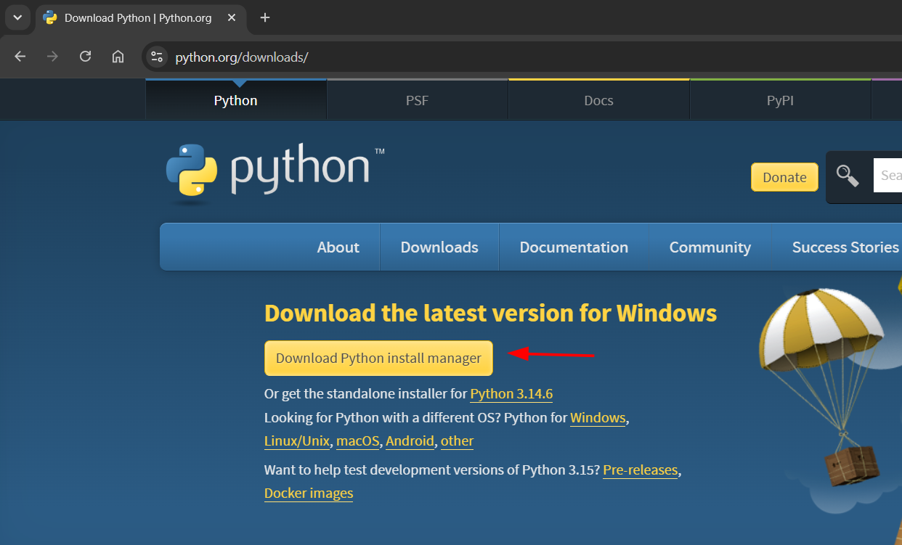
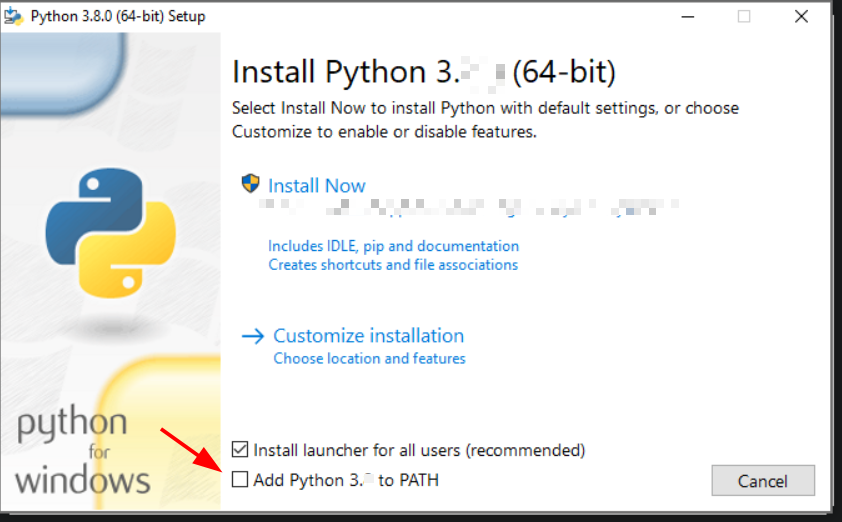
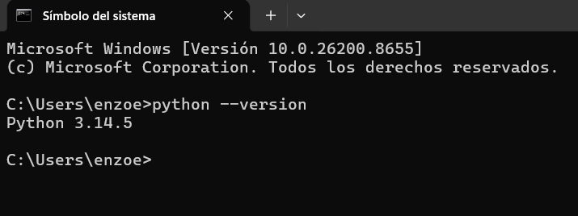
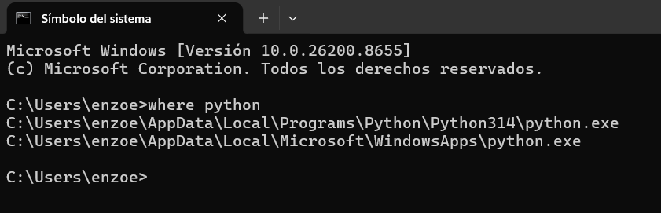

# 🐍 01 - Instalar Python

Python es el lenguaje de programación que utilizaremos durante todo este curso.

Es uno de los lenguajes más populares del mundo y se utiliza en:

* Desarrollo web
* Inteligencia Artificial
* Ciencia de datos
* Automatización
* Testing
* APIs
* Desarrollo de videojuegos

---

# 📥 Descargar Python

Ingresar al sitio oficial:

https://www.python.org/downloads/

Hacer clic en:

Descargar la última versión estable disponible.

<p align="center">
    
</p>

---

# ⚠ IMPORTANTE

Antes de hacer clic en **Install Now**, marcar:

```text
☑ Add Python to PATH
```

Esta opción permite ejecutar Python desde cualquier terminal.

Si no la marcás, Python se instalará pero Windows no reconocerá el comando `python`.

<p align="center">
    
</p>

---

# ▶ Instalar

Hacer clic en:

```text
Install Now
```

Esperar a que finalice la instalación.

Al terminar debería aparecer:

```text
Setup was successful
```
<p align="center">
    
</p>

---

# 🧪 Verificar instalación

Abrir:

```text
cmd
```

Ejecutar:

```bash
python --version
```

Resultado esperado:

```text
Python 3.x.x
```

Ejemplo:

```text
Python 3.14.5
```

<p align="center">
    
</p>

---

# 🧪 Verificar la ruta de instalación

Ejecutar:

```bash
where python
```

Resultado esperado:

```text
C:\Users\TU_USUARIO\AppData\Local\Programs\Python\Python314\python.exe
```

La ruta puede variar según la versión instalada.

<p align="center">
    
</p>

---

# ⚠ Problemas frecuentes

## "'python' no se reconoce como un comando"

Ejemplo:

```text
'python' no se reconoce como un comando interno o externo
```

Esto suele ocurrir porque:

* Python no está instalado.
* No se marcó:

```text
☑ Add Python to PATH
```

### Solución

Reinstalar Python y asegurarse de marcar:

```text
☑ Add Python to PATH
```

---

## Se abre Microsoft Store

Al ejecutar:

```bash
python
```

Windows abre Microsoft Store.

### Solución

Ir a:

```text
Configuración

→ Aplicaciones

→ Alias de ejecución de aplicaciones
```

Desactivar:

```text
python.exe

python3.exe
```

---

# 🎯 Objetivo

Si llegaste hasta acá deberías poder ejecutar:

```bash
python --version
```

y obtener algo similar a:

```text
Python 3.x.x
```

Si funciona, Python está correctamente instalado.

---

# 🚀 Próximo paso

Continuar con:

```text
02_instalar_vscode.md
```