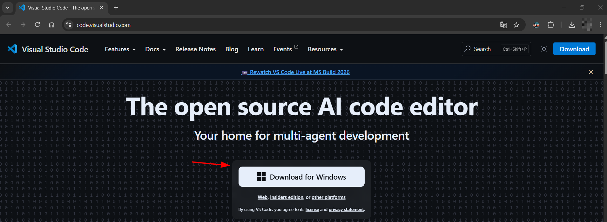
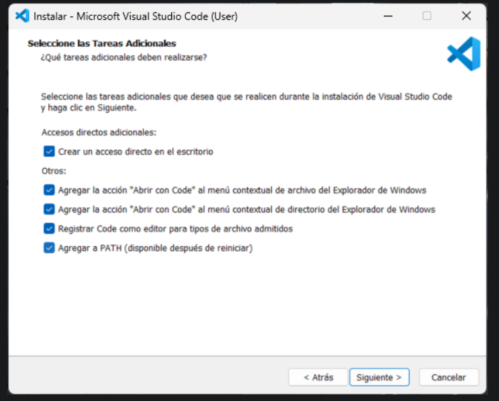
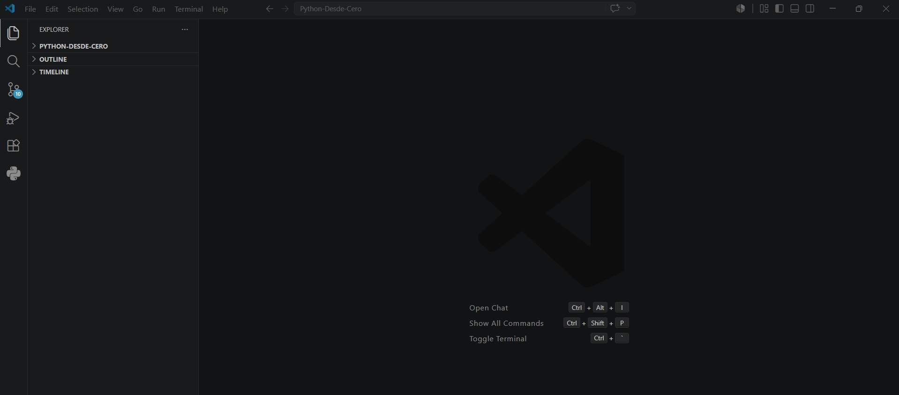
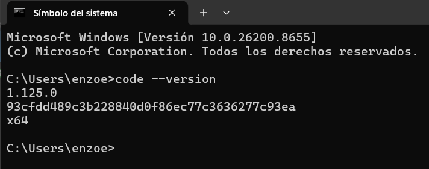

# 💻 02 - Instalar VS Code

Visual Studio Code (VS Code) será el editor de código que utilizaremos durante todo este curso.

Es gratuito, liviano y tiene soporte para Python, Git y miles de extensiones.

---

# 📥 Descargar VS Code

Ingresar al sitio oficial:

https://code.visualstudio.com/

Hacer clic en:

```text
Download for Windows
```

Descargar la versión estable más reciente.

<p align="center">
    
</p>

---

# ▶ Instalar VS Code

Ejecutar el instalador descargado.

Durante la instalación se recomienda marcar las siguientes opciones:

```text
☑ Add "Open with Code" action to Windows Explorer file context menu

☑ Add "Open with Code" action to Windows Explorer directory context menu

☑ Register Code as an editor for supported file types

☑ Add to PATH
```

Estas opciones permiten:

* Abrir archivos con VS Code desde Windows.
* Abrir carpetas con VS Code desde el explorador.
* Ejecutar el comando `code` desde la terminal.
* Asociar archivos de código con VS Code.

<p align="center">
    
</p>

---

# 🚀 Primer inicio

Una vez finalizada la instalación, reiniciar y luego abrir:

```text
Visual Studio Code
```

La pantalla principal debería verse similar a esta:

<p align="center">
    
</p>

---

# 🧪 Verificar instalación

Abrir:

```text
CMD
```

Ejecutar:

```bash
code --version
```

Resultado esperado:

```text
1.xx.x

xxxxxxxxxxxxxxxx

x64
```

Por ejemplo:

```text
1.101.2

2b9aebd5354a3629c3aba0a5f5df49f43d6689f8

x64
```

Si aparece una versión, VS Code quedó correctamente instalado.

<p align="center">
    
</p>

---

# ⚠ Problemas frecuentes

## El comando `code` no funciona

Ejemplo:

```text
'code' no se reconoce como un comando interno o externo
```

Esto suele ocurrir porque durante la instalación no se marcó:

```text
☑ Add to PATH
```

### Solución

Reinstalar VS Code y marcar esa opción.

---

## VS Code abre en inglés

Es completamente normal.

Durante este curso utilizaremos los nombres originales:

```text
Explorer

Terminal

Extensions

Source Control
```

porque son los mismos nombres que aparecen en la documentación oficial y en la mayoría de tutoriales.

---

# 🎯 Objetivo

Si llegaste hasta acá deberías tener:

✅ VS Code instalado.

✅ VS Code abre correctamente.

✅ El comando:

```bash
code --version
```

funciona desde la terminal.

---

# 🚀 Próximo paso

Continuar con:

```text
03_instalar_git.md
```