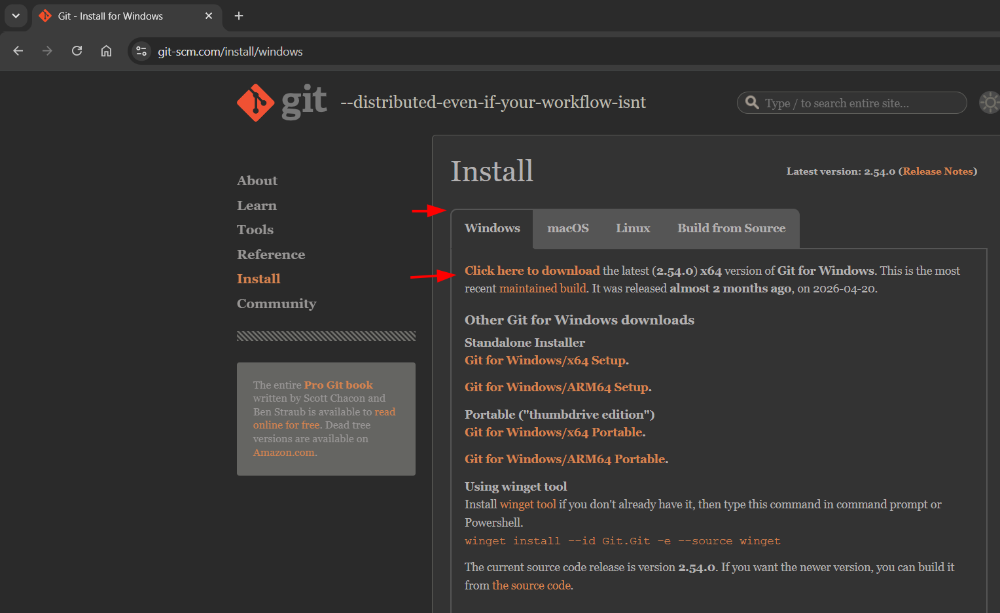
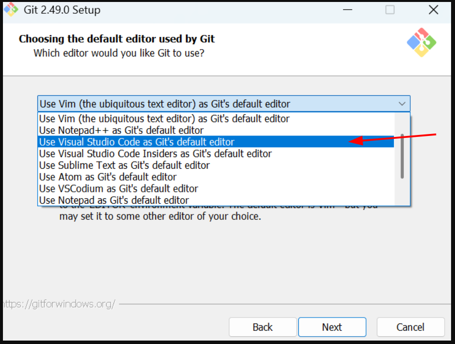
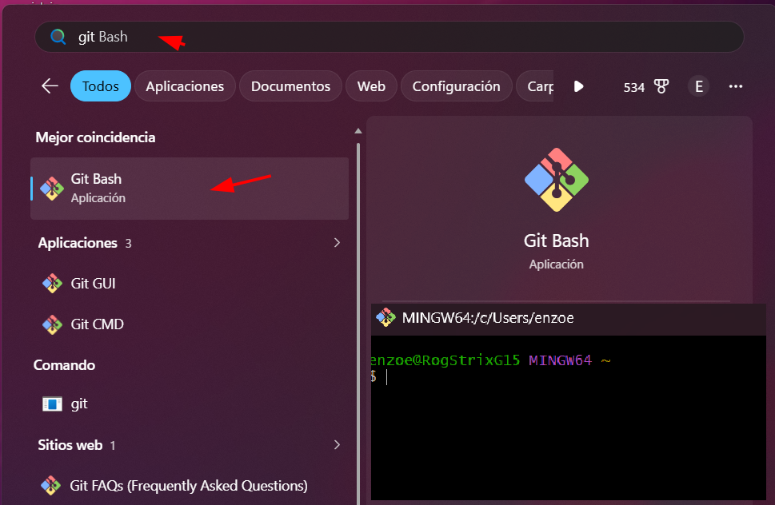
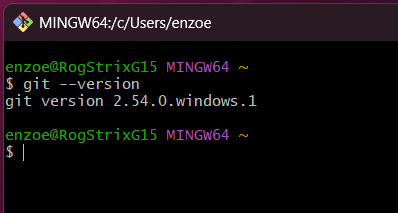

# 🌿 03 - Instalar Git

Git es un sistema de control de versiones.

Nos permite:

* guardar cambios en nuestros proyectos
* volver a versiones anteriores
* trabajar con GitHub
* colaborar con otras personas
* mantener un historial de nuestro código

Durante este curso utilizaremos Git y GitHub para guardar todos nuestros ejercicios.

---

# 📥 Descargar Git

Ingresar al sitio oficial:

https://git-scm.com/downloads

Hacer clic en:

```text
Download for Windows
```

Descargar la última versión disponible.

<p align="center">
    
</p>

---

# ▶ Instalar Git

Ejecutar el instalador descargado.

Durante la instalación podés dejar prácticamente todas las opciones por defecto.

Se recomienda verificar que esté seleccionada la opción:

```text
Git Bash Here
```

y:

```text
Git from the command line and also from 3rd-party software
```

Estas opciones permiten:

* Abrir Git Bash desde cualquier carpeta.
* Usar Git desde la terminal.
* Integrar Git con VS Code.

<p align="center">
    
</p>

---

# 🚀 Primer inicio

Una vez finalizada la instalación, reiniciar Windows.

Luego abrir:

```text
Git Bash
```

Deberías ver una terminal similar a esta:

<p align="center">
    
</p>

---

# 🧪 Verificar instalación

Ejecutar:

```bash
git --version
```

Resultado esperado:

```text
git version 2.xx.x.windows.x
```

Por ejemplo:

```text
git version 2.50.1.windows.1
```

Si aparece una versión, Git quedó correctamente instalado.

<p align="center">
    
</p>

---

# ⚠ Problemas frecuentes

## El comando `git` no funciona

Ejemplo:

```text
'git' no se reconoce como un comando interno o externo
```

Esto suele ocurrir porque:

* Git no está instalado.
* Durante la instalación no se agregó Git al PATH.

### Solución

Reinstalar Git y asegurarse de seleccionar:

```text
Git from the command line and also from 3rd-party software
```

---

## No aparece Git Bash

Buscar:

```text
Git Bash
```

desde el menú Inicio.

Si no aparece:

* Reiniciar Windows.
* Reinstalar Git.

---

# 🎯 Objetivo

Si llegaste hasta acá deberías tener:

✅ Git instalado.

✅ Git Bash instalado.

✅ El comando:

```bash
git --version
```

funciona correctamente.

---

# 🚀 Próximo paso

Continuar con:

```text
04_crear_cuenta_github.md
```