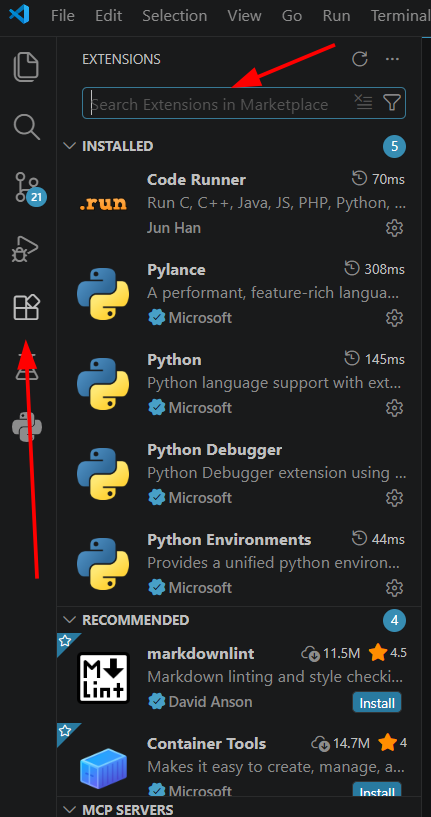
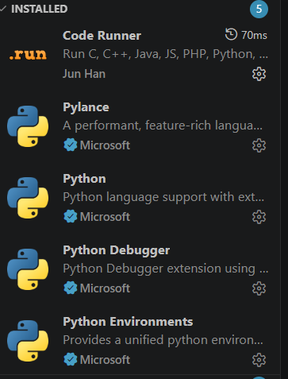

# 🧩 05 - Extensiones de VS Code

Las extensiones agregan nuevas funcionalidades a VS Code.

Durante este curso utilizaremos solamente las extensiones necesarias para trabajar con Python.

---

# 🚀 Abrir extensiones

Abrir VS Code.

Ir a:

```text
Extensions
```

o usar el atajo:

```text
Ctrl + Shift + X
```

Se abrirá el Marketplace de extensiones.

<p align="center">
    
</p>

---

# 🐍 Python

Buscar:

```text
Python
```

Autor:

```text
Microsoft
```

Instalar.

Esta extensión permite:

* ejecutar Python
* autocompletado
* resaltado de sintaxis
* debugging
* integración con entornos virtuales

---

# ⚡ Pylance

Al instalar **Python**, normalmente VS Code instalará automáticamente:

```text
Pylance
```

Autor:

```text
Microsoft
```

Permite:

* autocompletado avanzado
* análisis de tipos
* sugerencias inteligentes
* navegación rápida por el código

---

# 🐞 Python Debugger

También suele instalarse automáticamente junto con Python.

Autor:

```text
Microsoft
```

Permite:

* ejecutar código paso a paso
* colocar breakpoints
* inspeccionar variables
* depurar errores

---

# 🌎 Python Environments

Autor:

```text
Microsoft
```

Permite:

* administrar entornos virtuales
* seleccionar versiones de Python
* cambiar intérpretes

Esta extensión también suele instalarse automáticamente.

---

# ▶ Code Runner

Buscar:

```text
Code Runner
```

Autor:

```text
Jun Han
```

Instalar.

Permite ejecutar rápidamente:

```text
.py

.js

.java

.cpp

y muchos otros lenguajes
```

Agrega el botón:

```text
▶ Run Code
```

en la esquina superior derecha.

---

# 📌 Extensiones utilizadas en este curso

| Extensión           | Autor     |
| ------------------- | --------- |
| Python              | Microsoft |
| Pylance             | Microsoft |
| Python Debugger     | Microsoft |
| Python Environments | Microsoft |
| Code Runner         | Jun Han   |

---

# 🖼 Captura de referencia

Estas son las extensiones instaladas utilizadas durante el curso:

<p align="center">
    
</p>

---

# 🎯 Objetivo

Si llegaste hasta acá deberías tener instaladas:

✅ Python

✅ Pylance

✅ Python Debugger

✅ Python Environments

✅ Code Runner

---

# 📌 Nota

Las extensiones:

```text
Pylance

Python Debugger

Python Environments
```

generalmente se instalan automáticamente al instalar:

```text
Python (Microsoft)
```

Por eso normalmente solo tendrás que instalar:

* Python
* Code Runner

y el resto aparecerá automáticamente.

---

# 🚀 Próximo paso

Continuar con:

```text
06_settings_json.md
```