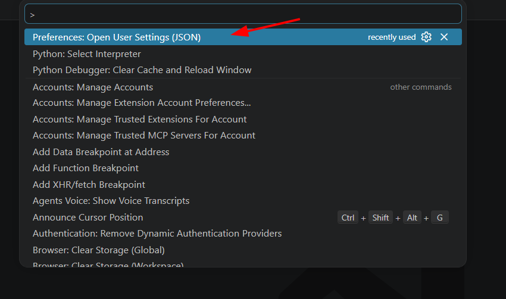
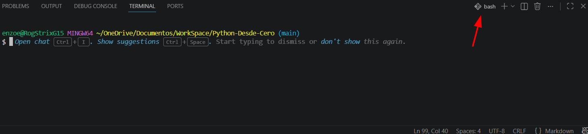
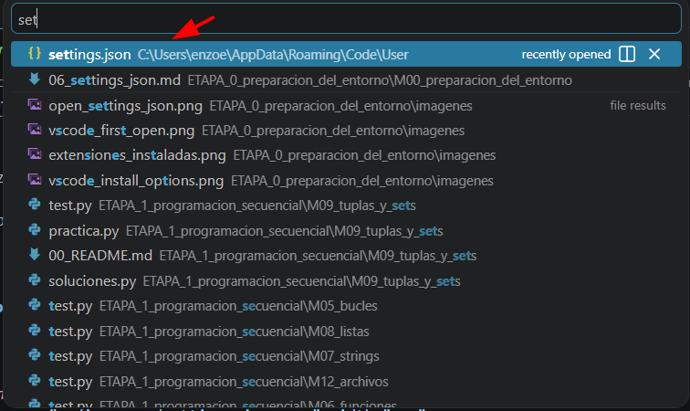

# ⚙️ 06 - Mi configuración de VS Code (`settings.json`)

VS Code permite personalizar su comportamiento mediante un archivo llamado:

```text
settings.json
```

En este curso utilizaremos una configuración simple, enfocada en Python y Git.

---

# 📂 ¿Dónde se encuentra?

En Windows:

```text
C:\Users\TU_USUARIO\AppData\Roaming\Code\User\settings.json
```

También podés abrirlo desde VS Code.

Presionar:

```text
Ctrl + Shift + P
```

Buscar:

```text
Preferences: Open User Settings (JSON)
```

y presionar Enter.

<p align="center">
    
</p>

---

# 📄 Mi configuración

Copiar y pegar:

```json
{
    "terminal.integrated.profiles.windows": {
        "PowerShell": {
            "source": "PowerShell",
            "icon": "terminal-powershell"
        },

        "Command Prompt": {
            "path": [
                "${env:windir}\\Sysnative\\cmd.exe",
                "${env:windir}\\System32\\cmd.exe"
            ],
            "args": [],
            "icon": "terminal-cmd"
        },

        "Git Bash": {
            "path": "C:\\Program Files\\Git\\bin\\bash.exe",
            "args": []
        }
    },

    "terminal.integrated.defaultProfile.windows": "Git Bash",

    "explorer.confirmDelete": false,

    "python.terminal.activateEnvironment": false,
    "python.defaultInterpreterPath": "C:/Users/enzoe/AppData/Local/Programs/Python/Python314/python.exe",
    "python.terminal.launchArgs": [],
    "python.terminal.executeInFileDir": true,

    "code-runner.runInTerminal": true,
    "code-runner.clearPreviousOutput": true,
    "code-runner.preserveFocus": false,
    "code-runner.reuseTerminal": true,
    "code-runner.executorMap": {
        "python": "python"
    },
    "explorer.confirmDragAndDrop": false,
    "explorer.confirmPasteNative": false
}
```

---

# 🐚 Git Bash como terminal por defecto

```json
"terminal.integrated.defaultProfile.windows": "Git Bash"
```

Hace que al abrir la terminal aparezca:

```text
Git Bash
```

que será la terminal utilizada durante todo el curso.

<p align="center">
    
</p>

---

# 🗑 No pedir confirmación al borrar

```json
"explorer.confirmDelete": false
```

Evita mostrar:

```text
¿Está seguro de eliminar este archivo?
```

---

# 📁 No pedir confirmación al mover archivos

```json
"explorer.confirmDragAndDrop": false
```

Permite reorganizar carpetas más rápidamente.

---

# 🐍 Configuración de Python

```json
"python.terminal.activateEnvironment": false
```

Evita que VS Code active entornos virtuales automáticamente.

---

```json
"python.terminal.executeInFileDir": true
```

Hace que Python se ejecute desde la carpeta del archivo actual.

---

## ⚠ Ruta del intérprete

```json
"python.defaultInterpreterPath"
```

La ruta puede variar según tu computadora.

Ejemplo:

```text
C:/Users/enzoe/AppData/Local/Programs/Python/Python314/python.exe
```

Podés obtener tu ruta ejecutando:

```bash
where python
```

Si VS Code detecta Python automáticamente, esta línea puede omitirse.

---

# ▶ Configuración de Code Runner

```json
"code-runner.runInTerminal": true
```

Hace que Code Runner utilice la terminal integrada.

Esto evita problemas con:

* `input()`
* caracteres especiales
* lectura de archivos

---

```json
"code-runner.clearPreviousOutput": true
```

Limpia la salida anterior antes de ejecutar nuevamente.

---

```json
"code-runner.reuseTerminal": true
```

Reutiliza siempre la misma terminal.

Evita abrir una terminal nueva cada vez que ejecutamos código.

---

# 🖼 Captura

Agregar imagen:

<p align="center">
    
</p>

---

# 🎯 Objetivo

Si llegaste hasta acá deberías tener:

✅ Git Bash como terminal predeterminada.

✅ Python configurado.

✅ Code Runner configurado.

✅ VS Code listo para comenzar a programar.

---

# 🚀 Próximo paso

Continuar con:

```text
07_git_basico.md
```